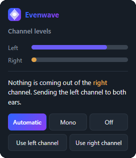

# Evenwave

**Sound coming out of one ear? Evenwave fixes it while you watch.**

Some YouTube videos are recorded with the audio stuck in a single channel. You
hear half of it, you check your headphones, you blame your headphones. Evenwave
spots it in a couple of seconds and sends the good channel to both ears.

## It tells you when it steps in

No settings to dig through, no page to reload — just a quick note that it
handled it.

## And you stay in charge

Click the toolbar icon to see what each channel is actually doing, and take the
wheel whenever you want.

## Modes

- **Automatic** – step in only when one side is truly dead. *(Default — set it
  and forget it.)*
- **Mono** – always mix both channels into both ears.
- **Use left / Use right** – force a channel when detection is unsure, like a
  side that's very quiet rather than silent.
- **Off** – hands off, audio untouched.
